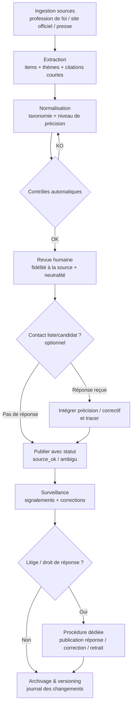

# Propositions ou mesures pour un comparateur municipal

## Résumé exécutif

Votre dilemme (« propositions » vs « mesures ») est moins un choix binaire qu’un arbitrage entre **couverture** (tout le monde a des orientations et des promesses) et **auditabilité** (seules certaines promesses sont suffisamment concrètes pour être comparées, chiffrées, et suivies). Dans le contexte français des municipales 2026 (scrutin les 15 et 22 mars 2026), les **sources officielles** disponibles à grande échelle sont surtout des documents de **profession de foi** et des contenus de campagne hétérogènes, publiés tardivement et parfois seulement sur certaines communes (ex. mise en ligne officielle annoncée à partir du 9 mars 2026, sous conditions). citeturn16view0turn7view1turn20view0

La recommandation pragmatique est une **approche hybride “engagements”** :
- afficher par défaut des **propositions** (lisibles, comparables, couverture forte) ;
- qualifier chaque item par un **niveau de précision** (orientation → action → mesure chiffrée/KPI → calendrier/budget) afin de faire émerger les **mesures** quand elles existent, sans pénaliser les listes qui communiquent plus “à l’orientation”.  
Cette hybridation limite les biais éditoriaux (risque d’avantager ceux qui chiffrent davantage), améliore l’UX (filtres puissants), et rend la modération/fact-checking industrialisable (contrôles adaptés au niveau de preuve). citeturn10view0turn7view2turn9view0

Sur le plan juridique/éthique, les points structurants sont :
- **diffamation / injure** et prudence dans l’attribution (la reproduction d’une imputation attentatoire est punissable, même sous forme dubitative) ; citeturn15view0
- **droit de réponse en ligne** (obligation d’insertion dans des délais courts dans certaines conditions) ; citeturn11view3
- **droit électoral** : ne pas publier/“pousser” de contenus pouvant être caractérisés comme de la propagande à partir de la veille du scrutin à 0h (notamment diffusion par voie électronique de messages ayant ce caractère) ; citeturn12view0
- **RGPD** : éviter de traiter/inférer des “opinions politiques” d’utilisateurs (catégorie particulière de données) ; citeturn14view1
- **traceurs** : privilégier une mesure d’audience respectueuse (ou consentement conforme) et éviter les dispositifs de ciblage, d’autant que le cadre européen sur la publicité politique ciblée est renforcé depuis octobre 2025. citeturn11view6turn7view6turn19view0

Budget, taille d’équipe, périmètre géographique et modèle économique : **non spécifié**. Le rapport propose donc des options “solo / petite équipe / partenariat média/associatif” et une feuille de route 3–6–12 mois.

## Définitions et exemples concrets

### Définition opérationnelle

**Proposition** (programme, promesse, orientation) : énoncé d’intention ou d’action **sans spécification complète** des paramètres d’exécution (budget, calendrier, indicateurs, périmètre juridique/compétence). Une proposition peut être très concrète (“créer une ferme municipale pédagogique”) tout en restant non chiffrée, non datée ou sans modalités. Ce type de formulation est fréquent dans des comparateurs municipaux existants qui classent “par thématiques” et listent des idées/actionnables. citeturn10view1turn10view0turn7view2

**Mesure** (action chiffrée, engagement concret) : engagement formulé de manière **testable** (au moins une combinaison parmi : quantité, échéance, budget, indicateur/KPI, livrable, périmètre). L’idée n’est pas seulement “plus précise”, mais **vérifiable** a posteriori (ex. “plan de plantation de 10 000 arbres d’ici 2028, budget X, indicateur Y”). En pratique, certaines initiatives de comparaison ajoutent une dimension “coûts”/“chiffrage” justement pour monter en rigueur (au prix d’une complexité méthodologique). citeturn9view0

### Exemples tirés de comparateurs municipaux français

- Sur un comparateur municipal “par thématique”, on observe des items comme “objectif zéro déchets” accompagné d’actions (étude des flux, dispositifs de compostage), ou des projets de transport (ex. prolongement d’une ligne, amélioration de desserte) : ce sont souvent des **propositions structurées**, parfois semi-mesurables, mais rarement entièrement chiffrées et datées. citeturn10view0  
- Un autre comparateur présente des listes d’actions par thème (écologie, PLU, cartographie thermique, etc.), typiquement utiles pour la comparaison **qualitative** plus que pour l’audit quantitatif. citeturn10view1

### Où trouver les textes “source” dans un cadre officiel

Le site officiel d’information électorale explique que le programme est notamment porté par la **profession de foi**, envoyée aux électeurs, et qu’une mise en ligne “Programme des candidats” complète cet envoi (avec mise en ligne environ deux semaines avant le scrutin, selon la logique de campagne officielle). citeturn20view0  
Pour les municipales 2026, la plateforme officielle annonce une mise à disposition des professions de foi **à partir du 9 mars 2026**, et précise que cela concerne des communes de **2 500 habitants et plus** lorsque les commissions de propagande ont décidé la mise en ligne. citeturn7view1

### Panorama de comparateurs existants en France et lecture de leur approche

- **Comparateur “par thématiques” local** : l’interface propose de sélectionner deux candidats/listes et d’afficher leurs programmes par catégories (écologie, logements, etc.). L’approche est orientée “propositions”, avec une granularité variable selon les listes. citeturn10view0turn10view1  
- **Comparateur “Programmes Municipales” (municipales 2020)** : présenté par un média local comme un outil pour comparer les propositions “par thématiques”, avec possibilité de désélectionner des listes et, surtout, une logique d’enrichissement par citoyens/candidats/médias (crowdsourcing), donc une approche “propositions” + gouvernance éditoriale. citeturn7view2  
- **Initiative d’analyse avec dimension “coûts”** : une organisation décrit explicitement qu’elle compare les programmes des candidats dans plusieurs grandes villes et pose la question “pour quels coûts ?”, ce qui se rapproche d’une logique “mesures” (ou au moins “propositions outillées” par chiffrage). citeturn9view0  
- **Comparateurs orientés “positionnement” (questionnaires)** : un outil académique/média décrit une “boussole” reposant sur des questions et un positionnement des candidats “sur la base de leurs programmes”. C’est souvent très utile pour l’utilisateur final, mais cela introduit un autre objet : non pas l’inventaire des mesures, mais la réduction des programmes en axes/positions. citeturn1search3  
- **Comparateur national de programmes (présidentielle)** : un grand média a proposé un comparateur des “promesses/programmes” candidat par candidat. Même si hors municipales, c’est un précédent français fort, plutôt axé “propositions” (avec structuration éditoriale et rubriques). citeturn0search0

image_group{"layout":"carousel","aspect_ratio":"16:9","query":["programme-candidats interieur gouv elections municipales 2026 capture ecran","94 citoyens comparateur programmes municipales capture ecran","Programmes Municipales comparateur programmes capture ecran","Institut Montaigne municipales 2020 programmes couts capture ecran"],"num_per_query":1}

## Tableau comparatif par dimension

Le tableau ci-dessous synthétise avantages/inconvénients **par dimension**, en considérant un comparateur municipal à l’échelle d’une ou plusieurs communes.

| Dimension | Afficher **Propositions** | Afficher **Mesures** |
|---|---|---|
| Définition & exemples | **+** couvre orientations, promesses, actions. **–** ambigu sur “ce qui compte comme engagement”. Les comparateurs municipaux existants listent souvent des items thématiques de ce type. citeturn10view0turn7view2 | **+** cadre plus strict (“action testable”). **–** risque d’écarter une grande partie des programmes faute de chiffrage/dates (biais de couverture). |
| Granularité de l’info | **+** s’adapte à hétérogénéité des listes et communes. **–** granularité variable, comparabilité partielle. citeturn10view1 | **+** granularité normalisée (KPI, budget, horizon). **–** nécessite un modèle de données plus complexe et plus de champs “NA”. |
| Vérifiabilité & sources | **+** vérifiable “a minima” par citation de la profession de foi / source de campagne. La profession de foi est un artefact officiel de programme. citeturn20view0turn7view1 | **+** mieux vérifiable (objectifs datés, quantifiés). **–** vérification exige aussi compétence/finançabilité (plus proche d’un audit). Une dimension “coûts” existe mais implique une démarche méthodologique lourde. citeturn9view0 |
| Risques juridiques & éthiques | **+** moindre risque de “faux exact” chiffré, mais risque de reformulation trompeuse. **–** si vous réécrivez/qualifiez, attention à diffamation/injure par attribution. citeturn15view0 | **+** clarifie “qui a promis quoi”. **–** risque accru : un mauvais chiffrage attribué peut porter atteinte à la réputation (diffamation), et la contestation est plus probable. citeturn15view0 |
| Droit électoral & neutralité | **+** plus proche d’un inventaire documentaire (si sourcé), donc “information” plutôt que propagande. **–** attention à l’animation éditoriale à la veille du scrutin (gel conseillé). citeturn12view0turn7view3 | **+** favorise redevabilité. **–** peut être perçu comme un “jugement” (si vous notez/rankez), donc nécessité accrue de neutralité/méthode publique. citeturn7view3 |
| UX (lisibilité, filtres, comparaisons, mobile) | **+** lecture rapide (cartes, listes, thèmes). **–** comparaisons “côte-à-côte” difficiles si textes longs et non normalisés. Les comparateurs existants utilisent souvent un tri par thématiques. citeturn7view2turn10view0 | **+** UX puissante (tri par budget, échéance, indicateur). **–** risque de complexité cognitive et d’écrans “vides” (peu de mesures). |
| Maintenance & scalabilité | **+** ingestion rapide (extraction semi-manuel). **–** hétérogénéité coûteuse à nettoyer. La France compte des dizaines de milliers de communes, ce qui rend l’industrialisation clé. citeturn18view1 | **+** meilleure industrialisation une fois le schéma stable. **–** coût initial élevé (modèle, QA, outillage), et charge constante de validation. |
| Modération & fact-checking | **+** contrôle principal = “fidélité à la source” (citation/extrait + lien). **–** risque de paraphrase contestable. citeturn11view4 | **+** contrôle en couches (source + cohérence du chiffrage + unité). **–** nécessite process plus proche de fact-check/évaluation (temps humain). |
| Acceptation utilisateurs & confiance | **+** impression de neutralité si vous montrez la source officielle (profession de foi) et votre méthode. citeturn20view0turn7view1 | **+** perçu comme “sérieux” si bien fait. **–** fort risque de défiance si erreurs ; la CNIL documente un contexte de signalements massifs autour des pratiques de campagne (sensibilité du sujet). citeturn19view1 |
| SEO & viralité | **+** bon “long tail” thématique local (ex. “logement + commune”). **–** si contenu trop proche des sources, risque faible différenciation. | **+** pages “mesure X” très partageables. **–** volume de contenu plus faible. Structuration (schéma, dates) aide l’indexation. citeturn5search1turn5search5 |
| Accessibilité & inclusivité | **+** texte explicatif compatible lecture facile si réécrit. **–** risque de jargon politique. RGAA/WCAG imposent un cadre de conception accessible (navigation, contrastes, etc.). citeturn7view7turn2search5 | **+** champs structurés (unités, échéances) facilitent certaines aides (filtres). **–** tableaux complexes plus difficiles sur mobile et pour certains handicaps si mal conçus ; mêmes exigences RGAA/WCAG. citeturn2search4turn2search17 |
| Recommandation technique | **+** schéma simple (item, thème, source). **–** limitée pour tri/analytique. | **+** schéma riche (KPI, budget, calendrier) ; API plus “queryable”. **–** nécessité de versioning et validation forte. |

Conclusion analytique : **“Propositions” optimisent la couverture et l’activation utilisateur**, alors que **“Mesures” optimisent la comparabilité forte et la vérifiabilité**, mais au prix d’un coût (données + QA) et d’un risque (erreur contestable) supérieurs. Les comparateurs municipaux observés en France proposent majoritairement des comparaisons **par thèmes** d’items de programme (propositions), tandis que les démarches ajoutant “coûts” se rapprochent d’une couche “mesures/chiffrage”. citeturn10view0turn7view2turn9view0

## Cadre juridique et éthique pour un comparateur municipal

Cette section ne remplace pas un avis d’avocat ; elle vise à baliser les risques les plus probables avec des références robustes.

### Diffamation, injure, attribution et rectification

La loi sur la liberté de la presse définit la diffamation comme l’allégation ou imputation d’un fait portant atteinte à l’honneur/la considération, et rappelle que la publication (y compris “par voie de reproduction”) est punissable, même sous forme dubitative. Cela implique qu’un comparateur qui **attribue** à tort à une liste un fait précis (“a menti”, “a détourné”, etc.) ou relaie une accusation peut s’exposer. citeturn15view0

Conséquence pratique :
- éviter les libellés accusatoires ; préférer **descriptions sourcées** (“le programme indique…”) + lien/extrait ;
- prévoir un **mécanisme de correction** rapide, horodaté, et traçable.

### Droit de réponse sur un service en ligne

Le droit français prévoit un mécanisme de réponse pour “toute personne nommée ou désignée” dans un service de communication au public en ligne, avec obligation d’insertion sous délai (sanction prévue en cas de manquement), et renvoi aux conditions de la loi de 1881. Pour un comparateur de candidats, cela incite à prévoir une procédure outillée (réception, vérification d’identité, publication de la réponse). citeturn11view3

### Droit électoral : prudence à l’approche du scrutin

Le Code électoral interdit, à partir de la veille du scrutin à zéro heure, de diffuser par voie électronique tout message ayant le caractère de propagande électorale. Même si un comparateur se veut informatif, **l’animation** (push notifications, mises en avant, “dernière minute”, scoring, publicité) peut être requalifiée si elle ressemble à un acte de propagande. citeturn12view0

Par ailleurs, le site officiel rappelle que la propagande est encadrée pour garantir l’égalité entre candidats, et signale notamment l’interdiction de porter un élément nouveau de polémique électorale trop tard (principe visant d’abord les candidats, mais utile comme règle interne de modération éditoriale : éviter de publier un contenu polémique tardif non contradictoire). citeturn7view3turn6search3

Recommandation : instaurer un **gel éditorial** (ex. freeze des nouveautés, seulement corrections matérielles) à partir de J-1 0h, et surtout documenter publiquement votre politique (ce que vous publiez, ce que vous ne publiez plus). citeturn12view0

### RGPD : données personnelles, opinions politiques, cookies

Même si vous publiez des informations déjà publiques sur des candidats/listes, vous traitez potentiellement des **données personnelles** (identité, liste, photo). Le risque majeur vient surtout de l’autre côté : **les utilisateurs**.

Le RGPD interdit en principe le traitement des données révélant des “opinions politiques” (catégorie particulière) hors exceptions. Un comparateur qui enregistre une “compatibilité politique”, l’historique de consultation, ou des réponses à un questionnaire de valeurs/politiques peut ainsi créer des données sensibles. citeturn14view1

Les recommandations récentes de l’autorité de protection des données insistent sur la centralité du respect des règles dans le processus électoral et documentent l’ampleur des signalements lors des municipales 2020 (plusieurs milliers), ce qui indique une sensibilité forte du public. citeturn19view1

Sur les traceurs, l’autorité a adopté des lignes directrices et recommandations (consentement, contrôle accru) et continue de publier des mises à jour (y compris sur le consentement “multi-terminaux”). Un comparateur doit donc privilégier une mesure d’audience sobre (ou un consentement robuste), et éviter la collecte excessive. citeturn11view6turn5search4

Enfin, l’encadrement européen de la publicité politique ciblée (règlement 2024/900) est pleinement applicable depuis octobre 2025 et complète le RGPD pour les techniques de ciblage/diffusion d’annonces politique : si vous faites de la pub (même pour votre site) et utilisez du ciblage, il faut analyser l’applicabilité de ce cadre et, par prudence, éviter le ciblage politique. citeturn19view0turn7view6turn5search3

### Copyright : programmes, professions de foi et “courte citation”

Les textes de programme/profession de foi sont des œuvres potentielles. Le droit d’auteur prévoit une exception de courte citation/analyses (dans certaines conditions) : pour un comparateur, cela plaide pour (a) **extraits courts**, (b) mention claire de la source, (c) transformation éditoriale raisonnable (résumés), et (d) lien vers le document officiel quand disponible. citeturn11view4

### Mentions légales, responsabilité d’éditeur, modération

Les obligations de mentions légales (éditeur, hébergeur, etc.) et les sanctions en cas de manquement sont rappelées par des sources administratives, en cohérence avec le cadre LCEN. citeturn2search6turn11view2  
Si vous ouvrez des contributions (commentaires, “ajouter une proposition”, signalements), vous entrez aussi dans des logiques de traitement de contenus potentiellement illicites : le cadre européen des services numériques (DSA) et la LCEN structurent des attentes (point de contact, traitement des notifications, etc.), avec un impact surtout si vous scalez ou offrez des fonctionnalités de plateforme. citeturn6search18turn6search2turn11view2

## UX, accessibilité et SEO

### UX : lisibilité, filtres et comparaison côte-à-côte

Les comparateurs municipaux observés adoptent fréquemment un modèle “par thématiques”, où l’utilisateur filtre les listes et compare des blocs d’items (souvent des propositions), ce qui maximise la lisibilité à court terme et s’adapte aux programmes hétérogènes. citeturn7view2turn10view0

Impacts UX comparés :

- **Propositions** :  
  - meilleur “scan” (titres par thème, cartes) ;  
  - comparaison côte-à-côte parfois coûteuse si chaque item est long ;  
  - le tri intelligent (ex. “les plus similaires / les plus divergents”) dépend d’une taxonomie robuste.
- **Mesures** :  
  - UX de type “tableau de bord” possible (filtres par horizon, budget, KPI) ;  
  - risque d’être perçu comme technocratique ;  
  - sur mobile, les tableaux nécessitent des patterns accessibles (résumés + détails déroulants).

Recommandation UX structurante : afficher un objet unique “**engagement**” et rendre la différence visible via des **badges** :
- “Orientation”
- “Action”
- “Chiffré”
- “Daté”
- “Compétence commune / intercommunalité” (utile car certaines propositions relèvent d’un autre échelon, difficulté explicitement rencontrée par des comparateurs municipaux). citeturn7view2

### Accessibilité et inclusivité

En France, le référentiel RGAA (piloté par la direction interministérielle du numérique) outille concrètement l’accessibilité des sites et services, et le RGAA s’inscrit dans un cadre plus large de mise en accessibilité. citeturn7view7turn2search4  
Au niveau international, WCAG 2.2 est une recommandation W3C qui couvre un large éventail de critères d’accessibilité (navigation, focus, compréhension, etc.). citeturn2search5turn2search17

Implications spécifiques à votre comparateur :
- privilégier un mode “lecture facile” (résumé en langage clair) + un mode “preuve” (source, extrait, PDF) ;
- rendre les filtres utilisables clavier/lecteurs d’écran (composants accessibles) ;
- éviter les comparaisons uniquement visuelles : fournir une alternative textuelle (ex. “différences clés”).

### SEO et viralité : structuration et données enrichies

Pour Google, les données structurées aident à comprendre le contenu et peuvent rendre des résultats éligibles à des enrichissements ; la documentation recommande d’ajouter les propriétés pertinentes et de respecter des consignes de qualité. citeturn5search5turn5search25turn5search1

Recommandations SEO pragmatiques pour un comparateur local :
- pages stables “Commune → Listes/Candidats → Thèmes → Engagements” ;  
- affichage clair de la date de publication/mise à jour (utile pour l’utilisateur et l’indexation) ; citeturn5search13turn20view0
- métadonnées article (si vous avez des analyses) via schémas recommandés. citeturn5search1

Si vous fact-checkez des affirmations (ex. “le budget permet-il X ?”), il existe un type Schema.org “ClaimReview”, mais Google indique réduire/retirer le support du balisage ClaimReview dans les résultats de recherche (tout en restant utilisable dans Fact Check Explorer). Cela signifie : ne pas fonder votre stratégie SEO sur ClaimReview ; utilisez-le surtout comme structuration interne/interop. citeturn5search6turn5search2

## Architecture de données et recommandations techniques

Objectif : un modèle qui supporte **propositions** et **mesures** sans multiplier les objets, tout en permettant filtres, audit et versioning.

### Modèle de schéma de données recommandé

Approche conseillée : un objet central `engagement` (ou `commitment`) avec :
- `type_engagement` = `proposition` | `mesure`
- `niveau_precision` (enum) = `orientation` | `action` | `chiffre` | `kpi` | `budget` | `calendrier`  
et des champs optionnels fortement typés.

#### Tables principales (modèle relationnel lisible, transposable en document/graph)

| Table | Champ | Type | Obligatoire | Commentaire |
|---|---|---:|:---:|---|
| `election` | `election_id` | UUID | Oui | Identifiant unique (ex. Municipales 2026). |
|  | `type` | enum | Oui | `municipales`. |
|  | `tour` | enum | Oui | `T1`, `T2` (si applicable). |
|  | `date_scrutin` | date | Oui | Pour règles de gel éditorial, etc. citeturn16view0 |
| `commune` | `commune_insee` | string | Oui | Code INSEE, pour jointure open data. |
|  | `nom` | string | Oui |  |
|  | `population_ref` | int | Non | Utile pour règles (ex. seuils) ; source INSEE/administratif. citeturn17search4turn17search14 |
| `liste` | `liste_id` | UUID | Oui | Une “liste candidate” municipale. |
|  | `commune_insee` | string | Oui | FK `commune`. |
|  | `nom_liste` | string | Oui | Libellé officiel si possible. |
|  | `tete_de_liste` | string | Non | Donnée personnelle : minimiser (nécessaire ou non). |
| `engagement` | `engagement_id` | UUID | Oui | Objet central. |
|  | `liste_id` | UUID | Oui | FK `liste`. |
|  | `theme_id` | UUID | Oui | Taxonomie nationale + tags locaux. |
|  | `titre` | string | Oui | Court, affichable en carte. |
|  | `resume` | text | Oui | Résumé neutre, contrôlé. |
|  | `type_engagement` | enum | Oui | `proposition` / `mesure`. |
|  | `niveau_precision` | enum | Oui | Voir ci-dessus (sert à filtrer/afficher). |
|  | `competence` | enum | Non | `commune` / `intercommunalite` / `autre` ; utile car certaines promesses relèvent d’un autre niveau. citeturn7view2 |
|  | `statut_editorial` | enum | Oui | `brouillon` / `revue` / `publie` / `conteste` / `retire`. |
|  | `date_publication` | datetime | Oui | Transparence + SEO. citeturn5search13turn5search1 |
|  | `version` | int | Oui | Versioning interne (incrément). |
| `engagement_mesure` | `engagement_id` | UUID | Conditionnel | Présent si `type_engagement=mesure`. |
|  | `kpi_nom` | string | Non | Ex. “arbres plantés”. |
|  | `kpi_cible` | float | Non | Ex. 10000. |
|  | `kpi_unite` | string | Non | Ex. “arbres”. |
|  | `budget_estime_eur` | float | Non | “Non renseigné” si absent. |
|  | `debut` / `fin` | date | Non | Horizon de mise en œuvre. |
|  | `population_ciblee` | string | Non | Ex. “scolaires”, “PMR”. |
| `source` | `source_id` | UUID | Oui | Source(s) pour un engagement. |
|  | `engagement_id` | UUID | Oui | FK. |
|  | `type_source` | enum | Oui | `profession_foi_officielle` / `site_officiel_liste` / `communique` / `presse` / `debat`… |
|  | `url` | text | Oui | Lien vers la preuve (ou identifiant d’archive). |
|  | `date_source` | date | Non |  |
|  | `extrait` | text | Non | Courte citation (prudence droit d’auteur). citeturn11view4 |
| `factcheck` | `factcheck_id` | UUID | Non | Si vous faites une couche “vérification”. |
|  | `engagement_id` | UUID | Oui | FK. |
|  | `niveau` | enum | Oui | `source_ok` / `ambigu` / `conteste` / `corrige` … |
|  | `note_methodo` | text | Oui | Justification (transparente). |
| `signalement` | `signalement_id` | UUID | Non | Si vous ouvrez un canal public. |
|  | `objet_type` | enum | Oui | `engagement` / `liste` / `page`. |
|  | `motif` | enum | Oui | `erreur_factuelle` / `diffamation` / `copyright` / `autre`. |
|  | `statut` | enum | Oui | `recu` / `en_cours` / `resolu`. |

### API et métadonnées

Recommandations techniques :
- API “read-first” (public) + API d’admin (privée) ;  
- endpoints orientés filtres : `/communes/{insee}/themes`, `/listes/{id}/engagements?niveau_precision=...`;  
- `ETag` / cache HTTP fort (pics de trafic en période électorale) ;  
- métadonnées SEO (dates, dernier update) ; la documentation Google insiste sur l’ajout des propriétés pertinentes et la qualité des données structurées. citeturn5search1turn5search25turn5search5  
- versioning strict : conserver l’historique des modifications (qui a changé quoi, quand, pourquoi) pour gérer contestations/droit de réponse.

### Stratégie de sources prioritaires

Hiérarchie de collecte (du plus robuste au plus fragile) :
1) **Professions de foi** via le portail officiel lorsqu’il est disponible (couverture conditionnée, mais source forte). citeturn7view1turn20view0  
2) Sites officiels de campagne / communiqués (archiver / horodater).  
3) Presse locale/nationale fiable (pour contextualiser, pas pour inventer des engagements).  
4) Débats/meetings : seulement si vous conservez un verbatim (extrait court) et une date/lieu.

## Modération, fact-checking et plan opérationnel

### Workflow recommandé de modération et fact-checking

Ce workflow est conçu pour :
- séparer ce qui est **automatisable** (dédup, champs manquants, cohérence unités/dates) de ce qui exige une **revue éditoriale** (neutralité, reformulation) ;
- tracer les demandes/contestations, cohérent avec le contexte de forte sensibilité et de signalements documentés lors de campagnes. citeturn19view1turn11view3turn15view0

### Labels de confiance recommandés

Aligner des labels simples avec votre modèle “engagement” :
- **Source officielle** (profession de foi / site officiel)  
- **Source presse** (article identifié)  
- **Résumé éditorial** (avec extrait court + lien)  
- **Contesté** (avec historique des échanges)  
- **Corrigé** (avec versioning)

Sur le plan SEO, si vous publiez des pages de vérification, vous pouvez structurer (Schema.org), mais sans dépendre de ClaimReview comme levier de visibilité, Google réduisant son support dans Search. citeturn5search6turn5search2

### Checklist juridique et éthique avant publication

- Mentions légales complètes (éditeur, hébergeur, contact), conformément aux exigences rappelées par l’administration et le cadre LCEN. citeturn2search6turn11view2  
- Politique de confidentialité RGPD : finalités, base légale, durée de conservation, droits, contact. citeturn14view1turn19view2  
- Minimisation : éviter toute collecte qui révèle des **opinions politiques** d’utilisateurs (ou la rendre strictement optionnelle, consentement explicite, protections fortes). citeturn14view1  
- Cookies/traceurs : consentement conforme si non exempté ; refuser le “tout ou rien” et documenter. citeturn11view6turn5search4  
- Procédure de droit de réponse : canal dédié, délais, traçabilité. citeturn11view3  
- Politique anti-diffamation : neutralité de ton, attribution prudente, publication de corrections ; rappel : reproduction d’allégations diffamatoires punissable. citeturn15view0  
- Politique “période sensible” : gel des nouveautés à partir de J-1 0h, en cohérence avec l’interdiction de diffusion de propagande à partir de la veille du scrutin à 0h. citeturn12view0  
- Copyright : limiter les verbatims à des extraits nécessaires, sourcés ; privilégier le lien vers documents officiels. citeturn11view4turn7view1  
- Transparence méthodologique (page “méthode”) : sources acceptées, taxonomie, règles de classement, gestion des “NA”.  
- Gouvernance des contributions (si crowdsourcing) : règles, modération, responsabilité éditoriale ; s’inspirer des retours d’expérience de comparateurs ouverts. citeturn7view2  
- Si publicité payante pour promouvoir le site : analyser le cadre “publicité politique” (règlement 2024/900) et éviter ciblage politique ; sinon, transparence renforcée. citeturn19view0turn5search3turn7view6  
- Sécurité : journalisation des changements et contrôle d’accès (risque de sabotage / altérations en période électorale).  
- Accessibilité : audit RGAA (au moins sur parcours critiques) et correction des non-conformités majeures. citeturn2search8turn2search32  
- Archivage : conserver les sources (PDF officiels, captures horodatées) pour prouver la fidélité (utile en cas de contestation).

### Recommandations opérationnelles : priorités, MVP, feuille de route 3–6–12 mois

Hypothèses clés : budget/équipe **non spécifiés**. L’architecture ci-dessous propose trois scénarios d’exécution (solo, petite équipe, partenariat), mais une même logique produit.

**Priorités absolues (Semaine 1 à 4)**
1) Choisir l’objet éditorial unique : “**Engagement**” avec `niveau_precision` (au lieu de trancher “propositions vs mesures”).  
2) Mettre en place la collecte officielle : capacité à lier un engagement à une profession de foi (notamment via la plateforme officielle dès disponibilité) et à afficher la preuve. citeturn7view1turn20view0  
3) Implémenter une UX “par thème” + comparaison multi-listes (pattern déjà familier aux utilisateurs de comparateurs municipaux). citeturn7view2turn10view0  
4) Sécuriser juridique : mentions légales + politique de correction/droit de réponse + politique cookies minimale. citeturn2search6turn11view3turn11view6

**MVP réaliste (d’ici 3 mois)**
- Périmètre : 1 à 20 communes (ou uniquement > 2 500 hab. si vous vous alignez sur la disponibilité probable des professions de foi officielles en ligne). citeturn7view1  
- Fonctionnalités :
  - pages commune / listes / thèmes / engagements ;  
  - filtres : thème + niveau de précision + compétence ;  
  - preuve : source + extrait court + lien ;  
  - page “Méthode” + page “Signaler une erreur”.
- Données : viser d’abord “propositions” + marquage des engagements chiffrés quand présents.

**Extension à 6 mois**
- Industrialisation :
  - outillage d’ingestion (semi-automatique) ;  
  - taxonomie stabilisée (thèmes nationaux + tags locaux) ;  
  - tableau de bord modération ;  
  - A/B tests :
    - libellé “proposition” vs “engagement” vs “mesure” en UI ;
    - affichage par défaut : “tous” vs “seulement chiffré”.
- Indicateurs de confiance (KPI produit) :
  - taux de clic “voir la source” ;
  - taux de signalements par 1 000 engagements ;
  - délai médian de correction ;
  - part des engagements “source officielle”.

**Maturité à 12 mois**
- Passage à l’échelle :
  - couverture multi-départements / national, avec stratégie par strates (grandes communes → moyennes → long tail) ;  
  - API publique + export (open data) si juridiquement possible, en cohérence avec la réutilisation de données publiques sous Licence Ouverte (si vous réutilisez des jeux de données publics compatibles). citeturn6search5turn6search1turn6search17  
  - module “mesures” avancé :
    - budgets, calendriers, KPI ;
    - visualisations accessibles ;
    - historique des versions.
- Gouvernance :
  - charte d’indépendance ;
  - comité de relecture (si partenariat média/asso) ;
  - conformité accessibilité renforcée (audit RGAA récurrent). citeturn2search4turn2search32

**Décision finale sur le libellé public (“Propositions” vs “Mesures”)**

Recommandation de wording (pragmatique, orientée adoption) :
- Dans l’interface : **“Engagements”** (catégorie mère)  
- Filtres/badges : “Propositions” et “Mesures chiffrées” (ou “Engagements chiffrés”)  
- Dans le contenu : toujours afficher la **source** et le niveau de précision.

Raison : “Engagements” évite de surpromettre un chiffrage systématique (souvent absent) tout en permettant, quand il existe, de mettre en avant la couche “mesures” de manière rigoureuse et triable. Cette logique est compatible avec la réalité des matériaux disponibles (professions de foi officielles, programmes hétérogènes, publication tardive) et avec les patterns déjà utilisés par des comparateurs municipaux français (thématiques + items). citeturn7view1turn20view0turn10view0turn7view2